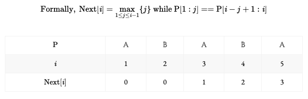
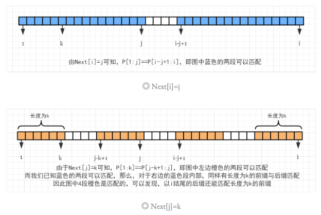
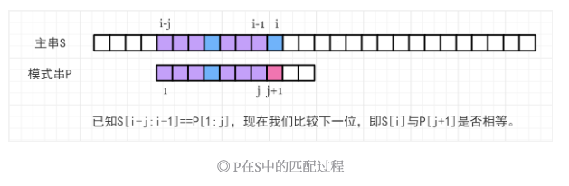
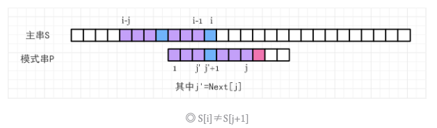

**KMP** 算法用于解决**字符串的单模匹配**问题，即在一个**主串 S** 中查找**模式串 P** 的所有出现位置，该算法解决此问题的**时间复杂度**为 **O(|S|+|P|)**。


## 1. 问题
给定一个主串 S，以及一个模式串 P。
求出 P 在 S 中所有出现的位置的起始下标（从 1 开始）。


## 2. Next 数组的性质
在 KMP 算法中，有一个很重要的数组，叫做 **Next** 数组（也有地方叫 Fail 数组或者前缀函数）。Next 数组巧妙地利用了模式串 P 中以**某个位置结尾的后缀**的与 P 的**前缀**匹配的信息，来加速 P 在 S 中的匹配过程。


Next[i] 表示模式串 P 中以 i（下标从 1 开始）结尾的真后缀能匹配 P 的真前缀的最大长度。


字符串的真后缀就是不包含自身的前缀，如字符串 abc 的真后缀有 c 和 bc，但 abc 不是真后缀。真前缀同理。**(简单的说就是真后缀不包含第一个字符，真前缀不包含最后一个字符)**





时刻记得 Next[ ] 表示的是模式串 P 的信息。


先不考虑 Next[ ] 如何求解，而是看看它有什么性质。


现在我们有一个字符串 P，并且已知了 Next[ ] 数组，有 Next[i]=j, Next[j]=k，那么有一个显然的性质：**k<j<i，如下所示：**





若 P **以 i 结尾**的**真后缀**能匹配 P 的z**真前缀**的最大长度为 Next[i]，那么它能匹配的次长前缀长度为 Next[Next[i]]，以此类推，Next[Next[Next[i]]]⋯ 直至匹配长度为 0 为止。


这是一条很重要的性质，是 KMP 算法的关键，它与模式串 P 在主串 S 中发生失配时的下一步操作有关。


## 3. KMP 匹配过程
**为了写代码方便，一般匹配的时候把 S[i] 和 P[j + 1] 进行比较。**


已知主串 S 和模式串 P，且 P 的 Next[ ] 数组已经求出来了，当前主串 S 匹配到下标 i−1 位置，模式串 P 匹配到下标 j 位置，即满足 S[i−j:i−1]==P[1:j]，如下图所示：




1. S[i] == P[j+1]，则 j 后移一位，表示这一位匹配成功，此时如果 j 到达了 P 串的末尾，说明 P 在 S 中出现了，在 S 中的起始下标为 i−|P|+1，**在主串 S 中找到匹配串 P 了**。
1. S[i] ≠ P[j+1]，发生失配，此时难道我们需要从头开始匹配吗？不需要，我们已经知道了 P 中以 j 结尾的后缀已经能与 S 中以 i−1 结尾的后缀能够匹配，我们希望 P 串向右移动最少，即希望_移动后_ P 的前缀能与 S 中以 i−1 结尾的后缀匹配尽可能长，而 S 中以 i−1 结尾的后缀又等效于 P 中以 j 结尾的后缀，这恰好就是 Next[j] 的含义，S[i−Next[j]: i−1] == P[1:Next[j]]，也就是图中标记的紫色部分匹配。那么只要将 P 中第一段紫色移动到第二段位置即可，如下图所示：




上述移动的过程，就是令 j = Next[j]。然后我们只需要再**比较 S[i] 与 P[j+1] 是否匹配即可**。如果不匹配就需要不断回退 j = Next[j]，其实就是不断用 P 中已经能与 S 中以 i−1 结尾的后缀匹配的前缀，减少中间多余匹配过程，在不断失配的过程中，所使用的 P 的前缀长度递减，直至为 0。如果经过某次 j 的回退，满足了 S[i]==P[j+1]，那么 j 就可以后移了。图中表现的是，经过一次回退，就能成功匹配的情况（此时 S[i] 和 P[j+1] 都是蓝色的小方块）。


以上就是 KMP 算法的匹配过程。


## 4. Next 数组求解
next 数组的求解和 KMP 的匹配类似，KMP 的匹配过程是主串 S 和匹配串 P 的匹配，next 数组是本身真前缀和真后缀之间的匹配。也就是说我们可以把 Next[ ] 的求解过程看成是**两个相同的串 P 匹配**的过程，也可以看成**模式串 P 自身与自身匹配**的过程。


首先对于 P 串，显然有 Next[1] = 0（因为只考虑_真_前/后缀），然后两个指针 i=2, j=0 开始。


考虑 P[i] 与 P[j+1] 是否匹配

- 如果不匹配，那么 j=Next[j] 不断回退，直到回退到匹配长度为 0 或者某一个 j 能满足 P[i]==P[j+1]；
- 如果 P[i]==P[j+1]，j 后移，说明以 P 中以 i 结尾的真后缀能匹配 P 的前缀的最大长度为 j，因此 Next[i]=j。是不是与 KMP 匹配过程如出一辙呢？代码如下：


```cpp
Next[1] = 0; /* 全局变量时可省略 */
for (int i = 2, j = 0; i <= n; i++) {
    while (j && p[i] != p[j + 1]) j = Next[j];
    if (p[i] == p[j + 1]) j++;
    Next[i] = j; /* 更新Next */
}
```


## 5. 时间复杂度分析

Next[ ] 求解与 KMP 匹配的时间复杂度分析类似，这里就分析一下 KMP 的匹配过程的时间复杂度。


首先，在每次 i++ 的过程中，j 最多只会增加一次，因此 j 总共最多增加 |S| 次.


而 while 循环中 j 总共的回退次数不可能超过它增加的次数，因此 while 循环中 j 最多回退 |S| 次.


所以 KMP 匹配过程时间复杂度为 O(|S|)。Next[ ] 求解时间复杂度为 O(|P|)。因此，整个算法的总时间复杂度为 O(|S|+|P|)。


## 6. KMP
给定一个模式串 S，以及一个模板串 P，所有字符串中只包含大小写英文字母以及阿拉伯数字。
模板串 P 在模式串 S 中多次作为子串出现。
求出模板串 P 在模式串 S 中所有出现的位置的起始下标。


**输入格式**

第一行输入整数 N，表示字符串 P 的长度。
第二行输入字符串 P。
第三行输入整数 M，表示字符串 S 的长度。
第四行输入字符串 S。


**输出格式**

共一行，输出所有出现位置的起始下标（下标从 0 开始计数），整数之间用空格隔开。


**数据范围**

- 1≤N≤10^5^
- 1≤M≤10^6^


**输入样例：**

3

aba 

5 

ababa 


**输出样例：**
0 2


```cpp
#include <bits/stdc++.h>

using namespace std;

const int N = 100010, M = 1000010;
char p[N], s[M];
int n, m, ne[N];

int main()
{
    cin >> n >> p + 1 >> m >> s + 1;
    
    for (int i = 2, j = 0; i <= n; i ++ )
    {
        while (j && p[i] != p[j + 1]) j = ne[j];
        if (p[i] == p[j + 1]) j++;
        ne[i] = j;
    }
    
    for (int i = 1, j = 0; i <= m; i++)
    {
        while (j && s[i] != p[j + 1]) j = ne[j];
        if (s[i] == p[j + 1]) j++;
        if (j == n)
        {
            cout << i - n << ' ';
            j = ne[j];
        }
    }
    return 0;
}
```
