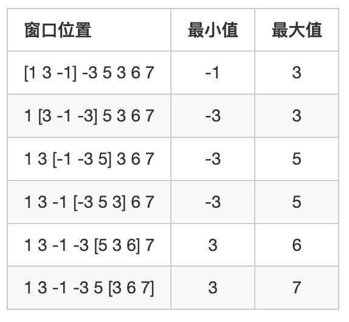

单调队列通常用来求解一个滑动窗口中的最大值或最小值
- 一个滑动窗口中的最大值：单调递减队列
- 一个滑动窗口中的最小值：单调递增队列

## [154. 滑动窗口](https://www.acwing.com/problem/content/description/156/)

给定一个大小为 n≤10^6^ 的数组。

有一个大小为 k 的滑动窗口，它从数组的最左边移动到最右边。

你只能在窗口中看到 k 个数字。

每次滑动窗口向右移动一个位置。

以下是一个例子：

该数组为 [1 3 -1 -3 5 3 6 7]，k 为 3
。


你的任务是确定滑动窗口位于每个位置时，窗口中的最大值和最小值。

**输入格式**

输入包含两行。

第一行包含两个整数 n 和 k，分别代表数组长度和滑动窗口的长度。

第二行有 n 个整数，代表数组的具体数值。

同行数据之间用空格隔开。

**输出格式**

输出包含两个。

第一行输出，从左至右，每个位置滑动窗口中的最小值。

第二行输出，从左至右，每个位置滑动窗口中的最大值。

**输入样例：**

8 3

1 3 -1 -3 5 3 6 7

**输出样例：**

-1 -3 -3 -3 3 3

3 3 5 5 6 7

**代码：**
```cpp
#include <iostream>

using namespace std;

const int N = 1e6 + 10;
int n, k, q[N], a[N], tt;
int hh = 1;

int main()
{
    cin >> n >> k;
    for (int i = 0; i < n; i++) cin >> a[i];
    
    for (int i = 0; i < n; i++)
    {
        if (hh <= tt && i - k + 1 > q[hh]) hh++;
        
        while (hh <= tt && a[q[tt]] >= a[i]) tt--;
        q[++tt] = i;
        if (i >= k - 1) cout << a[q[hh]] << ' ';
    }
    cout << endl;
    
    hh = 1, tt =0;
    for (int i = 0; i < n; i++)
    {
        if (hh <= tt && i - k + 1 > q[hh]) hh++;
        
        while (hh <= tt && a[q[tt]] <= a[i]) tt--;
        q[++tt] = i;
        if (i >= k - 1) cout << a[q[hh]] << ' ';
    }
    cout << endl;
    
    return 0;
}
```
