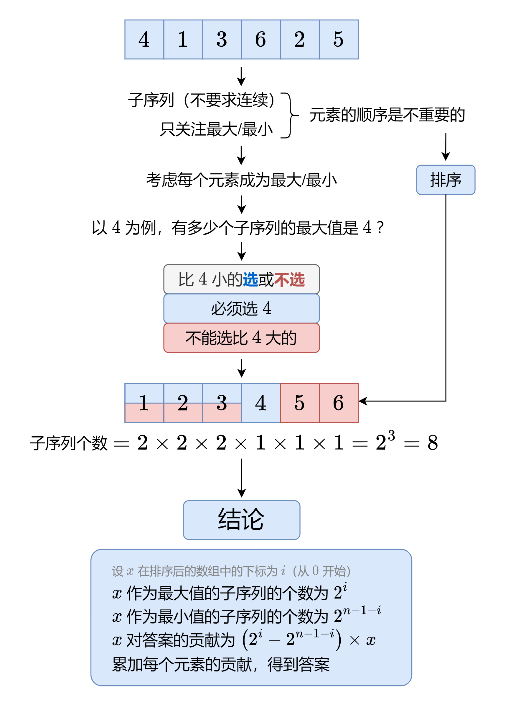

## [891. 子序列宽度之和 (Hard)](https://leetcode.cn/problems/sum-of-subsequence-widths/)

一个序列的 宽度 定义为该序列中最大元素和最小元素的差值。

给你一个整数数组 nums ，返回 nums 的所有非空 子序列 的 宽度之和 。由于答案可能非常大，请返回对 10^9^ + 7 取余 后的结果。

子序列 定义为从一个数组里删除一些（或者不删除）元素，但不改变剩下元素的顺序得到的数组。例如，[3,6,2,7] 就是数组 [0,3,1,6,2,2,7] 的一个子序列。

**示例 1：**

输入：nums = [2,1,3]
输出：6
解释：子序列为 [1], [2], [3], [2,1], [2,3], [1,3], [2,1,3] 。
相应的宽度是 0, 0, 0, 1, 1, 2, 2 。
宽度之和是 6 。

**示例 2：**

输入：nums = [2]
输出：0

**提示：**

- 1 <= nums.length <= 10^5^
- 1 <= nums[i] <= 10^5^

**思路：**

排序



**答疑**

**问**：对于数组中有重复元素的情况，这种做法不会重复统计吗？

**答**：不会。例如计算最大值时，如果有多个相同元素 x，那么每个 x 都只会考虑在它左侧的元素，而不会计入在它右侧的元素，所以不会有重复统计发生。

**问**：为什么 x 作为最小值的子序列的个数为 2^n-1-i^ ？

**答**：因为排序后，x 右侧有 n-1-i 个元素，每个元素都可以选或不选，这有 2^n−1−i^ 种方案，也就对应着 2^n−1−i^ 个子序列。

**代码**：

```python
class Solution:
    def sumSubseqWidths(self, nums: List[int]) -> int:
        MOD = 10**9 + 7
        n = len(nums)
        pow2 = [0] * n
        pow2[0] = 1
        for i in range(1, n):
            pow2[i] = pow2[i - 1] * 2 % MOD
        
        nums.sort()
        res = 0
        for i in range(n):
            x = nums[i]
            res = (res + (pow2[i] - pow2[n - 1 - i]) * x) % MOD
        
        return res
```

## [2104. 子数组范围和 (Medium)](https://leetcode.cn/problems/sum-of-subarray-ranges/)

给你一个整数数组 nums 。nums 中，子数组的 范围 是子数组中最大元素和最小元素的差值。

返回 nums 中 所有 子数组范围的 和 。

子数组是数组中一个连续 非空 的元素序列。

**示例 1**：

输入：nums = [1,2,3]

输出：4

解释：nums 的 6 个子数组如下所示：

[1]，范围 = 最大 - 最小 = 1 - 1 = 0 

[2]，范围 = 2 - 2 = 0

[3]，范围 = 3 - 3 = 0

[1,2]，范围 = 2 - 1 = 1

[2,3]，范围 = 3 - 2 = 1

[1,2,3]，范围 = 3 - 1 = 2

所有范围的和是 0 + 0 + 0 + 1 + 1 + 2 = 4

**示例 2**：

输入：nums = [1,3,3]

输出：4

解释：nums 的 6 个子数组如下所示：

[1]，范围 = 最大 - 最小 = 1 - 1 = 0

[3]，范围 = 3 - 3 = 0

[3]，范围 = 3 - 3 = 0

[1,3]，范围 = 3 - 1 = 2

[3,3]，范围 = 3 - 3 = 0

[1,3,3]，范围 = 3 - 1 = 2

所有范围的和是 0 + 0 + 0 + 2 + 0 + 2 = 4

**示例 3**：

输入：nums = [4,-2,-3,4,1]

输出：59

解释：nums 中所有子数组范围的和是 59

**提示**：
- 1 <= nums.length <= 1000
- -10^9^ <= nums[i] <= 10^9^
 

**思路**：

单调栈

**代码**：

```python
class Solution:
    def subArrayRanges(self, nums: List[int]) -> int:
        n = len(nums)
        l = [0] * n
        r = [0] * n
        stack = []
        for i in range(n):
            while len(stack) > 0 and nums[stack[-1]] >= nums[i]:
                stack.pop()
            if len(stack) == 0:
                l[i] = -1
            else:
                l[i] = stack[-1]
            stack.append(i)
        
        stack = []
        for i in range(n - 1, -1, -1):
            while len(stack) > 0 and nums[stack[-1]] > nums[i]:
                stack.pop()
            if len(stack) == 0:
                r[i] = n
            else:
                r[i] = stack[-1]
            stack.append(i)

        min_sum = 0
        for i in range(n):
            min_sum += nums[i] * (i - l[i]) * (r[i] - i)
        
        l = [0] * n
        r = [0] * n
        stack = []
        for i in range(n):
            while len(stack) > 0 and nums[stack[-1]] <= nums[i]:
                stack.pop()
            if len(stack) == 0:
                l[i] = -1
            else:
                l[i] = stack[-1]
            stack.append(i)
        
        stack = []
        for i in range(n - 1, -1, -1):
            while len(stack) > 0 and nums[stack[-1]] < nums[i]:
                stack.pop()
            if len(stack) == 0:
                r[i] = n
            else:
                r[i] = stack[-1]
            stack.append(i)
        
        max_sum = 0
        for i in range(n):
            max_sum += nums[i] * (i - l[i]) * (r[i] - i)

        return max_sum - min_sum
```
